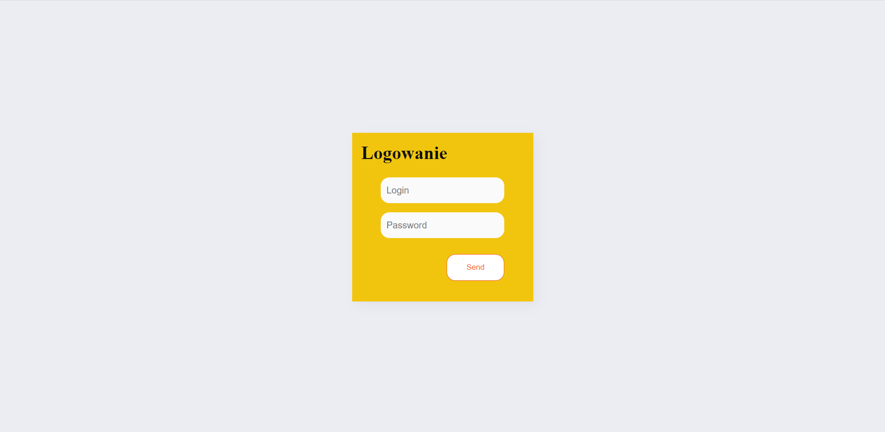

# Aplikacja w oparciu o mini-framework `PureJS`

live:
https://budnickip.github.io/pureJSFrameworkTask/

Oprócz standardowych zagadnień, do aplikacji została dodana walidacja formularzy(formularz nie przepuści nas dalej, jeśli pole login lub password będzie puste i wyświetli nam komunikat o błędzie). Podczas ładowania danych z API wyświetlany jest Loader, aby użytkownik wiedział, że aplikacja się nie zawiesiła i czeka na odpowiedź. Użytkownik próbując wejść na stronę:

https://budnickip.github.io/pureJSFrameworkTask/#/success

bez wcześniejszego logowania się otrzyma komunikat, że musi najpierw się zalogować(najlepiej sprawdzić to w oknie incognito, ponieważ gdy już raz się zalogujemy to nasze dane zostają zapisane do sessionStorage)

Screenshot widoku home



Aplikacja składa się z dwóch widoków:
1. Home - prosty formularz z polami `username` i `password`, przycisk `submit`.
2. Success - strona powitalna z informacją o udanej akcji.

Po przesłaniu formularza aplikacja przekierowuje do strony success lub wyświetlia informację o błędzie.

##### Część zaawansowana
Zmodyfikowany projekt w taki sposób, aby każda templatka była w osobnym pliku. 

##### Rozwiązanie
Na rozwiązanie składa się:
- link do repozytorium
- screenshot widoku home

Oceniamy:
- działające rozwiązanie
- czysty i dobrze napisany kod
- minimalistyczny i estetyczny design

## Dokumentacja PureJS

Framework składa się z dwóch części
1. `engine.js` - silnik templatek
2. `router.js` - router i logika kontrolerów

## Dokumentacja API
*Example request*
```
POST https://zwzt-zadanie.netlify.app/api/login

{
  username: 'zwzt',
  password: 'secret'
}
```
*Example response*
```
{
  message: 'Login success!',
  token: 'eyJhbGciOiJIUz...'
}
```

Aby otrzymać komunikat o błędzie, trzeba w polu `password` wpisać `error`

*Example request*
```
POST https://zwzt-zadanie.netlify.app/api/login
{
  username: 'zwzt',
  password: 'error'
}
```
*Example response*
```
{
  message: 'Wrong password!',
  error: true
}
```
